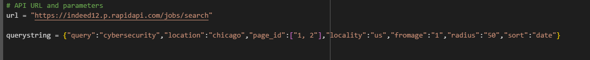
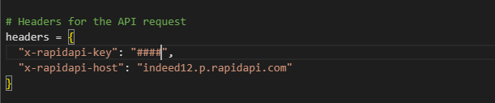

# IndeedJobSearch
The script performs the following tasks: Sends an HTTP GET request to the Indeed API using the RapidAPI platform to fetch job postings

# README.md

 

# Cybersecurity Jobs Data Extraction from Indeed API
This script extracts cybersecurity job postings in Chicago from the Indeed API, processes the data, and saves it to a CSV file.
Prerequisites
Before running the script, make sure you have the following installed:
Python 3.x
requests library
You can install the required libraries using pip:
bash
Copy code
pip install requests

# Overview
The script performs the following tasks:
Sends an HTTP GET request to the Indeed API using the RapidAPI platform to fetch job postings for cybersecurity in Chicago.
Parses the JSON response from the API.
Writes the job data to a CSV file (cyberjobsindeed_data.csv).
Script Details
API URL and Parameters
The script uses the following API URL and query parameters:
URL: https://indeed12.p.rapidapi.com/jobs/search
# Query Parameters:

query: The job title to search for (cybersecurity).
location: The job location (Chicago).
page_id: Pages to search (1, 2).
locality: Locality of the jobs (us).
fromage: Time frame (1 day).
radius: Search radius (50 miles).
sort: Sorting criterion (date).
# Headers

## The request headers contain:
x-rapidapi-key: Your RapidAPI key.
x-rapidapi-host: Host header required for the API.
Handling the API Response
The script checks if the API request was successful (status_code == 200).
It then parses the JSON response and prints it in a formatted structure to the console for debugging.
CSV File Output
The script writes the following fields to the CSV file: company_name, formatted_relative_time, id, link, locality, location, pub_date_ts_milli, and salary.
If any of the required fields are missing, an error message is printed.
Running the Script
Clone this repository or copy the script to your local environment.
Make sure the prerequisites are installed.
Set your RapidAPI key in the headers dictionary.
Run the script using Python:
bash
Copy code
python script_name.py


After execution, check the cyberjobsindeed_data.csv file for the extracted data.
# Troubleshooting
<!-- python code block -->

```python

 else:
                    print(f"Error: Missing job fields for job ID {job.get('id', '')}")

    print(f"Data successfully written to {csv_file}")

else:
    print(f"Error: Unable to fetch data (Status code: {response.status_code})")
```
 
API Key Error: Ensure your API key is valid and has the necessary permissions.
Connection Issues: Check your internet connection and ensure the API endpoint is reachable.
Missing Fields: If certain job fields are missing in the output, they may not be provided by the API. The script logs these instances for further review.

# Usage

Once the script is configured, run the code as shown below:

```python

import requests
import json
import csv

# API URL and parameters
url = "https://indeed12.p.rapidapi.com/jobs/search"

querystring = {"query":"cybersecurity","location":"chicago","page_id":["1, 2"],"locality":"us","fromage":"1","radius":"50","sort":"date"}


# Headers for the API request
headers = {
	"x-rapidapi-key": "Insert API Here",
	"x-rapidapi-host": "indeed12.p.rapidapi.com"
}

# API request
response = requests.get(url, headers=headers, params=querystring)

# Check if the request was successful
if response.status_code == 200:
    data = response.json()  # Extract the JSON data

    # Pretty print the JSON structure to understand its format
    formatted_json = json.dumps(data, indent=4)
    print(formatted_json)  # Print to console

    # Specify the CSV file name
    csv_file = 'cyberjobsindeed_data.csv'

    # Open CSV file for writing
    with open(csv_file, mode='w', newline='', encoding='utf-8') as file:
        writer = csv.writer(file)

        # Write the header row
        writer.writerow(["company_name", "formatted_relative_time", "id", "link", "locality",
                         "location", "pub_date_ts_milli", "salary"])

        # Write data rows
        if 'hits' in data:
            for job in data['hits']:
                # Validate job fields
                if all(key in job for key in ['company_name', 'formatted_relative_time', 'id', 'link', 'locality', 'location', 'pub_date_ts_milli']):
                    salary_info = job.get('salary', {})
                    salary_str = f"{salary_info.get('min', '')}-{salary_info.get('max', '')} {salary_info.get('type', '')}"
                    writer.writerow([
                        job['company_name'],
                        job['formatted_relative_time'],
                        job['id'],
                        job['link'],
                        job['locality'],
                        job['location'],
                        job['pub_date_ts_milli'],
                        salary_str
                    ])
                else:
                    print(f"Error: Missing job fields for job ID {job.get('id', '')}")

    print(f"Data successfully written to {csv_file}")

else:
    print(f"Error: Unable to fetch data (Status code: {response.status_code})")
 
```

# License
This project is licensed under the MIT License.
